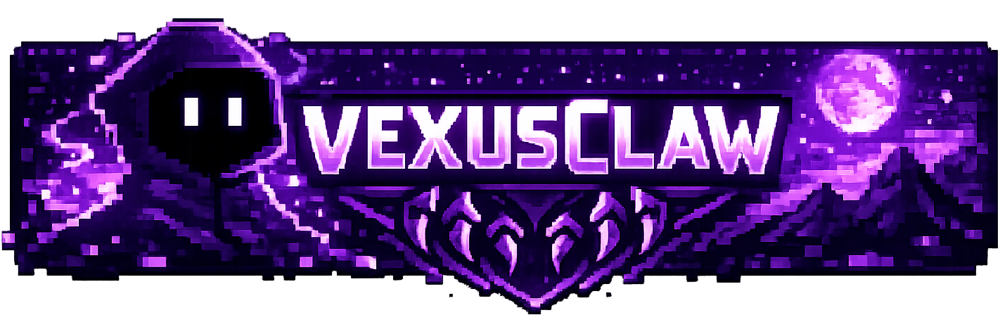

<p align="center">
#🧙‍♂️ VexusClaw — Personal AI Assistant
</p>
<p align="center">
  
</p>
<p align="center">
VEXUSCLAW is a self-hosted multi-channel agent platform built for operators who want a premium mission-control experience, deterministic infrastructure, and a modular orchestration core that can grow into a full agent ecosystem.
</p>
## Product shape

- `dashboard-php`: production dashboard served by Apache + PHP-FPM on self-host nodes.
- `apps/dashboard`: legacy Next.js mission control still kept in the repo.
- `apps/gateway`: Fastify API, orchestration entrypoint, healthchecks and event distribution.
- `apps/installer`: bootstrap process for assisted installation and environment generation.
- `packages/*`: shared business capabilities, contracts, adapters and infrastructure layers.
- `infra/*`: Docker, Apache, Caddy legacy, install and operations scripts.

## V1 priorities

- Extremely simple installation on VPS or bare server.
- Premium dashboard UX for operators.
- Strong module boundaries from day one.
- OpenAI connectivity in the first release.
- WhatsApp as the first end-to-end production channel target.
- WebChat scaffolded early and ready to be completed in the next implementation stage.

## Monorepo standards

- Node.js 22+
- `pnpm` workspaces
- TypeScript everywhere
- `turbo` for orchestration
- Prisma + PostgreSQL
- Redis + BullMQ
- Apache + PHP-FPM for the production dashboard path
- Docker Compose for `gateway`, `postgres`, and `redis`

## Quick start

```bash
corepack enable
corepack prepare pnpm@10.6.0 --activate
pnpm install
pnpm db:generate
pnpm dev
```

## Docker

```bash
docker compose -f infra/docker/docker-compose.yml up -d
```

By default this starts the backend services only: `postgres`, `redis`, and `gateway`.
The legacy Next/Caddy stack is now behind the optional `legacy-next` profile.

## Production install

Canonical installer:

```bash
curl -fsSL https://vexusclaw.com/install.sh | bash
```

The installer prefers the official GitHub repository at `https://github.com/vexusclaw-sys/vexusclaw-v1.0.01`.
If that repository is not yet populated, it falls back to the official tarball served by `vexusclaw.com`.

Official self-host with managed VEXUSCLAW subdomain:

```bash
curl -fsSL https://vexusclaw.com/install.sh | bash -s -- --install-token vxc_xxx --email owner@example.com
```

Custom base domain:

```bash
curl -fsSL https://vexusclaw.com/install.sh | bash -s -- --domain example.com --email owner@example.com --workspace user48217
```

Local equivalents:

```bash
bash deploy/install.sh
bash deploy/install.sh --update
bash deploy/install.sh --doctor
bash deploy/build-install-bundle.sh
```

Installer CLI:

```bash
pnpm --filter @vexus/installer exec tsx src/index.ts --help
pnpm --filter @vexus/installer exec tsx src/index.ts bootstrap run --non-interactive --base-url http://127.0.0.1:4000/api/v1 --domain vexusclaw.com --public-domain user33260.vexusclaw.com --workspace user33260 --email owner@example.com --password ChangeMeNow123! --provider mock --skip-default-agent --skip-whatsapp
pnpm --filter @vexus/installer exec tsx src/index.ts install-token issue --label "cliente-a"
pnpm --filter @vexus/installer exec tsx src/index.ts claim --api-base-url https://vexusclaw.com/api/v1 --install-token vxc_xxx
```

## Core workspaces

```text
apps/
packages/
infra/
docs/
.github/
```

## Production posture

- Public self-host nodes use Apache on `80/443` and render the PHP dashboard from `dashboard-php/`.
- `gateway`, `postgres`, and `redis` remain in Docker Compose.
- The official installer finalizes the workspace without creating any default agent on the customer VPS.
